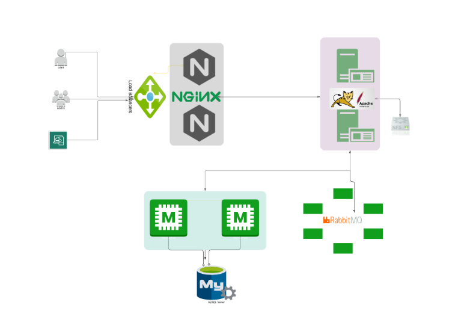

## Manual Provisioning of a Multi-tier stacked web-application written in Java

- This projected was deployed manually using 5 VMs provisioned via Vagrant with help of Virtual Box

## Project Architecture 



# Prerequisites

- JDK 1.8 or later
- Maven 3 or later
- MySQL 5.6 or later
- Vagrant 2.3 or later
- Virtual Box

## Technologies

- Spring MVC
- Spring Security
- Spring Data JPA
- Maven
- JSP
- MySQL

## Database

Here,we used Mysql DB
MSQL DB Installation Steps for Linux ubuntu 14.04:

- $ sudo apt-get update
- $ sudo apt-get install mysql-server

Then look for the file :

- /src/main/resources/accountsdb
- accountsdb.sql file is a mysql dump file.we have to import this dump to mysql db server
- > mysql -u <user_name> -p accounts < accountsdb.sql

Replace your repo definitions with vault URLs on the VMs. CentOS 7 base repos have moved to the vault since CentOS 7 went EOL (End of Life on June 30, 2024).

```bash
sudo sed -i 's|^mirrorlist=|#mirrorlist=|g' /etc/yum.repos.d/CentOS-Base.repo
sudo sed -i 's|^#baseurl=http://mirror.centos.org|baseurl=http://vault.centos.org|g' /etc/yum.repos.d/CentOS-Base.repo
```

```bash
export VAGRANT_WSL_ENABLE_WINDOWS_ACCESS="1"                    | Used to make WSL work with vagrant and grant windows access to Virtual box.
```
# Prerequisite

1. Oracle VM Virtualbox
2. Vagrant
3. Vagrant plugins

# Execute below command in your computer to install hostmanager plugin

```bash
vagrant plugin install vagrant-hostmanager          | Used to install the plugin manager for host management 
vagrant.exe reload web01                               | Used to reload a VM after making changes to the                                                      Vagrantfile. 
```

# VM SETUP

1. Clone source code.
2. Cd into the repository.
3. Switch to the main branch.
4. cd into vagrant/Manual_provisioning

```bash
vagrant up
```

## PROVISIONING - Use the instructions in the pdf file attached to provision services.

Services
1. Nginx => Web Service
2. Tomcat => Application Server
3. RabbitMQ => Broker/Queuing Agent
4. Memcache => DB Caching
5. ElasticSearch => Indexing/Search service
6. MySQL => SQL Database

Setup should be done in below mentioned order

1. MySQL (Database SVC)
2. Memcache (DB Caching SVC)
3. RabbitMQ (Broker/Queue SVC)
4. Tomcat (Application SVC)
5. Nginx (Web SVC)
